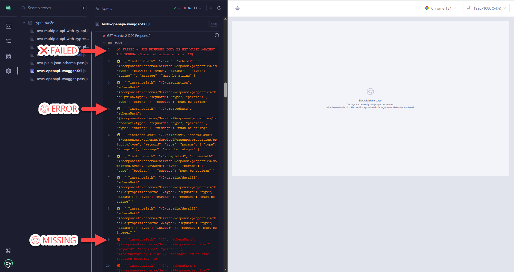
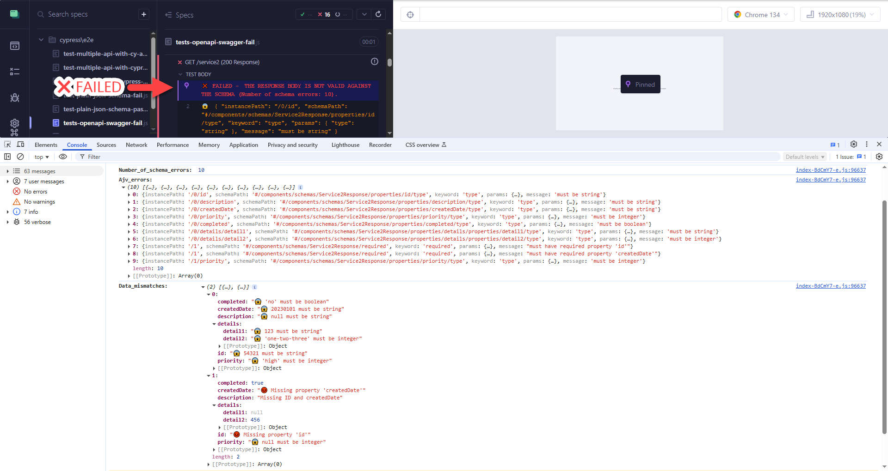
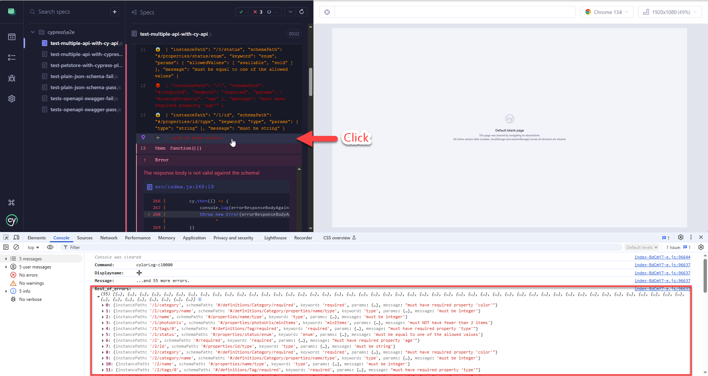
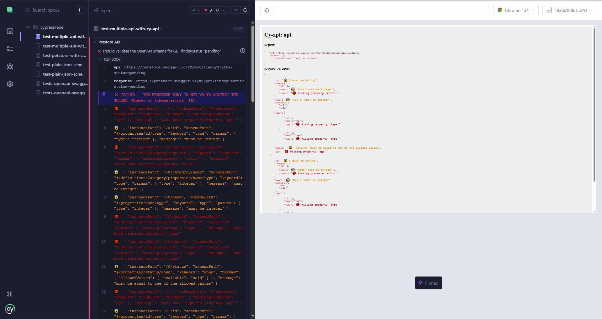
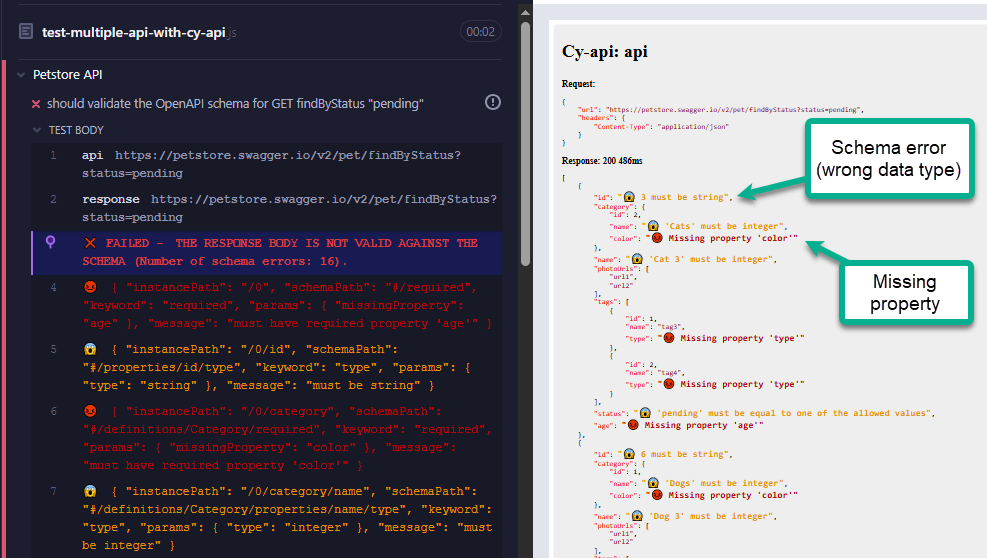
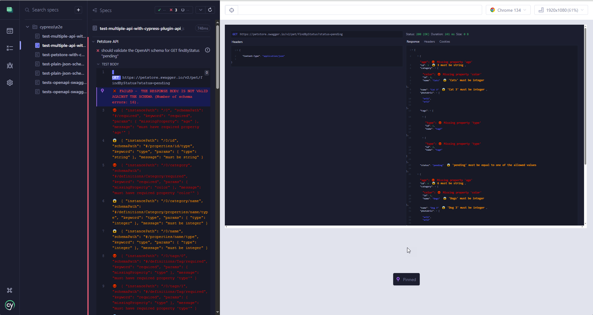
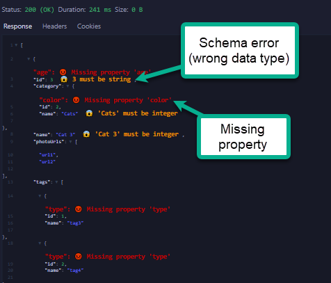

# cypress-ajv-schema-validator

A Cypress plugin for API schema validation against **plain JSON schemas**, **Swagger schema documents**, or **OpenAPI schema documents**.

> 🚀🚀🚀 **IMPORTANT NOTE: The `cypress-ajv_schema-validator` plugin is now considered legacy and is being replaced by the new `cypress-schema-validator`.
> The new `cypress-schema-validator` plugin is fully backward compatible with `cypress-ajv_schema-validator` and extends its API to support Zod schema validation in addition to AJV schema validation. 
> You can find the new plugin at https://www.npmjs.com/package/cypress-schema-validator

 

For a detailed guide on setting up and using `cypress-ajv_schema-validator` plugin to maximize its benefits, please refer to my articles:
  - ["CYPRESS-AJV-SCHEMA-VALIDATOR Plugin: The Brave Vigilante for Your API Contracts"](https://dev.to/sebastianclavijo/cypress-ajv-schema-validator-plugin-the-brave-vigilante-for-your-api-contracts-5cfe)
  - ["CYPRESS-AJV-SCHEMA-VALIDATOR v1.2.0: Boost Debugging Skills from Vigilante to Superhero with Advanced Schema Error Insights!"](https://dev.to/sebastianclavijo/cypress-ajv-schema-validator-v120-boost-debugging-skills-from-vigilante-to-superhero-with-advanced-schema-error-insights-1hld)


## Main Features

- Cypress command **`cy.validateSchema()`** to report JSON Schema validation errors in the response obtained from any network request with `cy.request()`.
  
- The command `cy.validateSchema()` is chainable and returns the original API response yielded.
  
- Schema is provided as a JSON object, that could come from a Cypress fixture.

- Uses the **core-ajv-schema-validator** plugin, which leverages the **Ajv JSON Schema Validator** as its engine **_(NEW in v2.0.0)_**.
  
- Supports schemas provided as **plain JSON schema**, **OpenAPI 3.0.1 schema document** and **Swagger 2.0 schema document**.
  
- Provides in the Cypress log a summary of the schema errors as well as a list of the individual errors in the schema validation.
  
- By clicking on the summary of schema errors in the Cypress log, the console will output:
  -  Number of schema errors.
  -  Full list of schema errors as provided by Ajv.
  -  A nested tree view of the validated data, clearly indicating the errors and where they occurred in an easy-to-understand format.

- New environment variable `disableSchemaValidation` to disable schema validation in your tests **_(NEW in v1.2.0)_**.

- Provides full integration with **Gleb Bahmutov**'s [@bahmutov/cy-api](https://github.com/bahmutov/cy-api) and **Filip Hric**'s [cypress-plugin-api](https://github.com/filiphric/cypress-plugin-api) plugins, enabling JSON schema validations to be performed directly after the `cy.api()` command.
  
  When enabled via the new environment variable `enableMismatchesOnUI`, schema errors are displayed directly in the user interfaces of these plugins **_(NEW in v1.2.0)_**.

> ⭐⭐⭐⭐⭐
> Example usage with these two API plugins:
> `cy.api('/users/1').validateSchema(schema);`
>
> To see an example of `cypress-ajv-schema-validator` working with the `@bahmutov/cy-api` and `cypress-plugin-api` plugins for the Swagger PetStore API, check the sample tests files [test-petstore-with-cypress-plugin-api.js](cypress/e2e/test-petstore-with-cypress-plugin-api.js) and [test-multiple-api.js](cypress/e2e/test-multiple-api.js).

&nbsp; 

## About JSON Schemas and Ajv JSON Schema Validator

### JSON Schema

JSON Schema is a hierarchical, declarative language that describes and validates JSON data.

### OpenAPI 3.0.1 and Swagger 2.0 Schema Documents

The OpenAPI Specification (formerly Swagger Specification) are schema documents to describe your entire API (in JSON format or XML format). So a schema document will contain multiple schemas, one for each supported combination of **_Endpoint - Method - Expected Response Status_** (also called _path_) by that API.

### Ajv JSON Schema Validator

AJV, or Another JSON Schema Validator, is a JavaScript library that validates data objects against a JSON Schema structure.

It was chosen as the core engine of the `cypress-ajv-schema-validator` plugin because of its versatility, speed, capabilities, continuous maintenance, and excellent documentation. For more information on Ajv, visit the [Ajv official website](https://ajv.js.org/).

Ajv supports validation of the following schema formats: **JSON Schema**, **OpenAPI 3.0.1** specification, and **Swagger 2.0** specification. However, Ajv needs to be provided with the specific schema to be validated for an endpoint, method, and expected response; it cannot process a full OpenAPI 3.0.1 or Swagger 2.0 schema document by itself.

The `cypress-ajv-schema-validator` plugin simplifies this by obtaining the correct schema definition for the endpoint you want to test. You just need to provide the full schema document (OpenAPI or Swagger) and the path to the schema definition of the service you want to validate for your API (_Endpoint - Method - Expected Response Status_).

> **Note:** The Ajv instance used in this plugin (`cypress-ajv-schema-validator`) is configured with the options `{ allErrors: true, strict: false }` to display all validation errors and disable strict mode.

&nbsp; 

## Installation

```sh
npm install -D cypress-ajv-schema-validator
```

## Compatibility

- Cypress 12.0.0 or higher
- Ajv 8.16.0 or higher
- ajv-formats 3.0.1 or higher

## Configuration

- Add the following lines either to your `cypress/support/commands.js` to include the custom command and function globally, or directly in the test file that will host the schema validation tests:

  ```js
  import 'cypress-ajv-schema-validator';
  ```

- To **disable schema validation** even when the `cy.validateSchema()` command is present in the test, set the Cypress environment variable `disableSchemaValidation` to `true`. By default, schema validation is enabled.

- To **enable the display of schema errors** directly in the user interfaces of the `@bahmutov/cy-api` and `cypress-plugin-api` plugins, set the Cypress environment variable `enableMismatchesOnUI` to `true`. By default, this feature is disabled.


## API Reference

### `cy.validateSchema(schema, path)`

It is expected to be chained to an API response (from a `cy.request()` or `cy.api()`). It validates the response body against the provided schema.

#### Parameters

- `schema` (object): The schema to validate against. Supported formats are plain JSON schema, Swagger, and OpenAPI documents.
- `path` (object, optional): This second parameter only applies to Swagger or OpenAPI documents. 
  It represents the path to the schema definition in a Swagger or OpenAPI document and is determined by three properties:
  - `endpoint` (string, optional): The endpoint path.
  - `method` (string, optional): The HTTP method. Defaults to 'GET'.
  - `status` (integer, optional): The response status code. If not provided, defaults to 200.

#### Returns

- `Cypress.Chainable`: The response object wrapped in a Cypress.Chainable.

#### Throws

- `Error`: If any of the required parameters are missing or if the schema or schema definition is not found.

Example providing a Plain JSON schema:

```js
cy.request('GET', 'https://awesome.api.com/users/1')
  .validateSchema(schema);
```

Example providing an OpenAPI 3.0.1 or Swagger 2.0 schema documents and path to the schema definition:

```js
cy.request('GET', 'https://awesome.api.com/users/1')
  .validateSchema(schema, { endpoint: '/users/{id}', method: 'GET', status: 200 });
```

Using the path defined by `{ endpoint, method, status }`, the plugin will automatically take the schema `$ref` for that definition, find it in the `components` section, and use it in the schema validation.

 

## Usage Examples

For detailed usage examples, check the document [USAGE-EXAMPLES.md](USAGE-EXAMPLES.md).

The examples included are for using:

- `cy.validateSchema()` command with a **Plain JSON schema**.
  
- `cy.validateSchema()` command with an **OpenAPI 3.0.1 schema** document.
  
- `cy.validateSchema()` command with a **Swagger 2.0 schema** document.
  
- `cy.validateSchema()` command in conjunction with **`cy.api()` from the `cypress-plugin-api` or `@bahmutov/cy-api` plugins**.


## Validation Results

Here are some screenshots of schema validation tests run in Cypress.

### Test Passed

When a test passes, the Cypress log will show the message: "✔️ **PASSED - THE RESPONSE BODY IS VALID AGAINST THE SCHEMA.**".

 

### Test Failed

When a test fails, the Cypress log will show the message: "❌ **FAILED - THE RESPONSE BODY IS NOT VALID AGAINST THE SCHEMA**"; indicating the total number of errors: _(Number of schema errors: N_).

Also, the Cypress log will show an entry for each of the individual schema validation errors as provided by Ajv. The errors that correspond to missing fields in the data validated are marked with the symbol 😡, and the rest of the errors with the symbol 😱.

 

#### Detailed Error View in the Console

If you open the Console in the browser DevTools, and click on the summary line for the schema validation error in the Cypress log, the console will display detailed information about all the errors. This includes:

- The total number of errors
- The full list of errors as provided by the Ajv.
- A user-friendly view of the mismatches between the validated data and the JSON schema, highlighting where each validation error occurred and the exact reason for the mismatch.

 

### Test Failed with More than 10 Errors

When there are more than 10 schema validation errors, the Cypress log will show only the first 10 and, at the end of the list, an additional line indicating "**...and _N_ more errors.**".

 

#### More Errors in the Console

When clicking on the "**...and N more errors.**" line in the Cypress log, the browser console will show additional details for the errors grouped under that entry as provided by Ajv.

 


## Integration with Gleb Bahmutov's `@bahmutov/cy-api` and Filip Hric's `cypress-plugin-api` Plugins

### @bahmutov/cy-api Plugin

When the Cypress environment variable `enableMismatchesOnUI` is set to `true`, and you have imported the `@bahmutov/cy-api` plugin into your `cypress/support/commands.js` or test file, schema validation mismatches will be displayed directly in the plugin's UI in a user-friendly format.

 

It will follow the the same color legend as in the Cypress Log.

 

### cypress-plugin-api Plugin

Similarly, when the Cypress environment variable `enableMismatchesOnUI` is set to `true`, and the `cypress-plugin-api` plugin is imported into your `cypress/support/commands.js` or test file, schema violations will be shown in the plugin's UI.

 

 


## Disable JSON Schema Validation in your Tests

You can disable schema validation in your tests by setting the Cypress environment variable `disableSchemaValidation` to `true`.

The environment variable can be set in various locations, depending on the specific contexts in which you want to disable the functionality.
- **Cypress Configuration File (`cypress.config.js`)**: This is useful for applying settings globally across all tests.
- **Cypress Environment File `(cypress.env.json)`**: Use this for setting environment variables to be accessible during specific test runs.
- **Command Line Interface (CLI) using `--env`**: This is ideal for temporary overrides during specific test executions without affecting other configurations.
- **Within Test Configuration**: Set it directly in the test file for precise control over individual test behaviors.

When schema validation is disabled for a test, the Cypress log and the browser console will display the following message:

 

&nbsp; 

## License

This project is licensed under the MIT License. See the [LICENSE](LICENSE) file for more details.


## Contributing

First off, thanks for taking the time to contribute!

To contribute, please follow the best practices promoted by GitHub on the [Contributing to a project](https://docs.github.com/en/get-started/exploring-projects-on-github/contributing-to-a-project "Contributing to a project") page.

And if you like the project but just don't have the time to contribute, that's fine. There are other easy ways to support the project and show your appreciation, which we would also be very happy about:
- Star the project
- Promote it on social media
- Refer this project in your project's readme
- Mention the project at local meetups and tell your friends/colleagues
- Buying me a coffee or contributing to a training session, so I can keep learning and sharing cool stuff with all of you.

<a href="https://www.buymeacoffee.com/sclavijosuero" target="_blank"></a>

Thank you for your support!


## Changelog

### [2.0.2]
- Update plugin description in README.md to mark as legacy plugin (check new plugin ["cypress-schema-validator"](https://www.npmjs.com/package/cypress-schema-validator))

### [2.0.1]
- Fix dependency issue with `core-ajv-schema-validator`.

### [2.0.0]
- Use of the plugin `core-ajv-schema-validator`.
- Remove public API function **`validateSchema()`**. The function `validateSchema()` is now available in the plugin `core-ajv-schema-validator`.
- Change in the icons for property error 😱, and property missing 😡.

### [1.4.0]
- Added types for command validateSchema (contribution by Murat K Ozcan).
- Fixed issue with package-lock.json
- Added .npmrc

### [1.3.0]
- Improved error messages when not chained to an API response.
- Updated icons for disable validation message.
- Improved API documentation.

### [1.2.0]
- Integration with bahmutov/cy-api and filiphric/cypress-plugin-api to show JSON violations directly in their outputs on the UI.
- New Cypress environment variable to disable schema validation.
- Change in the icons to flag schema issues.

### [1.1.1]
- Added details to documentation.

### [1.1.0]
- Added GitHub CI/CD workflow.

### [1.0.0]
- Initial release.


## External references

- [Murat Ozcan](https://www.linkedin.com/in/murat-ozcan-3489898/ "Murat Ozcan")
    - Video [Schema validation using cypress-ajv-schema-validator vs Optic](https://www.youtube.com/watch?v=ysCADOh9aJU "Schema validation using cypress-ajv-schema-validator vs Optic")
    - Video [Demo comparing API e2e vs Schema testing](https://www.youtube.com/watch?v=ePjcKMq4c2o "Demo comparing API e2e vs Schema testing")
    - Course [Epic Test Arch. - test everything, everywhere all at once](https://www.udemy.com/course/epic-test-arch-test-everything-everywhere-all-at-once/?referralCode=97449422709A69966E4B "Epic Test Arch. - test everything, everywhere all at once")

- [Joan Esquivel Montero](https://www.linkedin.com/in/joanesquivel/ " Joan Esquivel Montero") - Video [Cypress API Testing: AJV SCHEMA VALIDATOR](https://www.youtube.com/watch?v=SPmJvH5mYaU "Cypress API Testing: AJV SCHEMA VALIDATOR")

- [json-schema.org](https://json-schema.org/ "https://json-schema.org/") - Website [JSON Schema Tooling](https://json-schema.org/tools?query=&sortBy=name&sortOrder=ascending&groupBy=toolingTypes&licenses=&languages=&drafts=&toolingTypes=#json-schema-tooling "JSON Schema Tooling")

- [cypress.io](https://www.cypress.io/ "https://www.cypress.io/") - Blog [Elevate Your Cypress Testing: Top 10 Essential Plugins](https://www.cypress.io/blog/elevate-your-cypress-testing-top-10-essential-plugins "Elevate Your Cypress Testing: Top 10 Essential Plugins")

